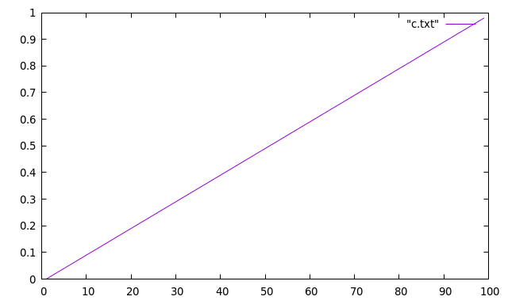
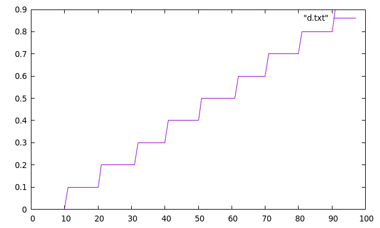
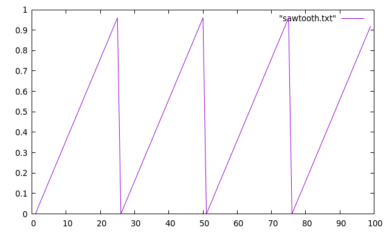
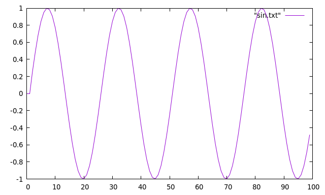
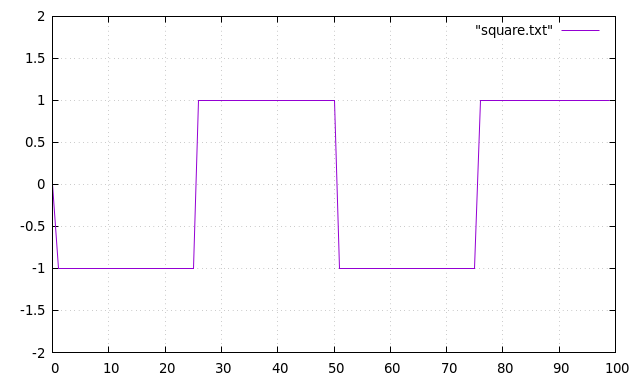

# Waveform
[Waveform](https://en.wikipedia.org/wiki/Waveform) or data types or function type


 

 

 

 

 

 


# source code
* [d.c](./src/d.c)
* results of the program  are in [the text files (./src/*.txt)](./src)


Compile and run the program

```
gcc d.c -Wall -Wextra -lm
a.out > c.txt
gnuplot
plot "c.txt" with lines 
# save image as a c.png
```
   

Similar repo
* [1D-RGB-color-gradient](https://github.com/adammaj1/1D-RGB-color-gradient)
* [Shaping functions in GLSL by Patricio Gonzalez Vivo & Jen Lowe](https://thebookofshaders.com/05/)
* [curves by kynd.inf ](https://www.flickr.com/photos/kynd/9546075099/in/photostream/)
* [GraphToy by Iñigo Quilez = a tool to visualize GLSL functions in WebGL](https://graphtoy.com/)


# Git


```
git add README.md
git commit -m "first commit"
git branch -M main
git remote add origin git@github.com:adammaj1/Waveform.git
git push -u origin main
```

Subdirectory

```
mkdir images
git add *.png
git mv  *.png ./png
git commit -m "move"
git push -u origin main

```

then link the images:

```
 
```
to overwrite

```
git mv -f 
```

local repo : 
