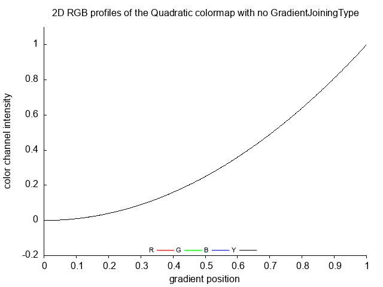

# Description
* [waveform](https://en.wikipedia.org/wiki/Waveform) 
* data types 
* functions  
  * [shaping functions](https://www.flong.com/archive/texts/code/shapers_poly/)  shaping signals in the normalized range [0, 1]
  * [Easing functions specify the rate of change of a parameter over time](https://easings.net/en)
  * [Tweening functions: The purpose of a tweening function is to deliver a position for a specific time, given the tween’s essential characteristics. These characteristics are beginning position, final position, and duration](http://robertpenner.com/easing/penner_chapter7_tweening.pdf). It is used in Flash for describe time related motion
  * [1D gray color gradient](https://github.com/adammaj1/1D-RGB-color-gradient)
* Pattern Master
* Unit generators
* Interpolation curves or interpolations
* [Parametric acceleration curves for animations](https://cocoawithlove.com/2008/09/parametric-acceleration-curves-in-core.html)


[Names or nomenclature comparison](./src/doc/comparison.md)


All functions work in the range [0..1].


# Algorithm:
* take input function f which maps floating point number (x or position) in a normalised range [0.0, 1.0] and gives monotone output ( [A monotonically non-decreasing function](https://en.wikipedia.org/wiki/Monotonic_function) )
* make function diagram  and color gradient ( image of continous color gradient) using above function
* make 3 types of periodic waves for each function type using ModifyPosition function
* make color diagram and color gradient for each GradientJoiningType of input function

```
typedef enum  {no, steps, tubes } GradientJoiningType; 


double ModifyPosition(const double position, const GradientJoiningType GradientJoining){
	
	// input position  should be in  [0,1] range 
	double p = position; // p = local copy of position
	// if position > 1 then we have repetition of colors = periodic function = wave   
	
	
	switch(GradientJoining){
	
		case no : {break;} // return input position witout modifications
		
		// periodic waves with different joinings
		case steps : {	p = p * segments; // periodic  = change range
				p = frac(p); 
    				break;}
    				
		case tubes : {	p = p * segments; // periodic = change range
				int ip = (int)p;
      				p = p-ip; // fractional part 
      				if (ip % 2) {p = 1.0-p;} // reverse gradient
				break;}
		default:{}
	}
	
	return p; // output in [0,1] range

}


```


So workflow 

$float x \to ModifyPosition \to GiveRGB_Gray \to Give_color \to color $


# old images ( made using ./src/d/d.c)


[Linear function](https://en.wikipedia.org/wiki/Linear_function) graph = made using [continous_data function ](./src/d/d.c)


 


[Step function](https://en.wikipedia.org/wiki/Step_function) graph. Made using [discrete_data function](./src/d/d.c) 


 


[Sawtooth wave](https://en.wikipedia.org/wiki/Sawtooth_wave) graph.  Made using [sawtooth_data function which includes steps type of joining](./src/d/d.c) 


 


[Sine wave](https://en.wikipedia.org/wiki/Sine_wave)


 


[Piecewise linear functions](https://en.wikipedia.org/wiki/Piecewise_linear_function):  [Boxcar function](https://en.wikipedia.org/wiki/Boxcar_function) or [square waveform](https://en.wikipedia.org/wiki/Waveform) or  [Rectangular function](https://en.wikipedia.org/wiki/Rectangular_function), the simplest [step_function](https://en.wikipedia.org/wiki/Step_function). It is made using [square_wave function ](./src/d/d.c) 


 


[Triangle wave](https://en.wikipedia.org/wiki/Triangle_wave) = made from linear function using tubes type of joining  


 


# new images ( made using ./src/g/g.c)


 Linear 
Linear_no
 
 
 
 
Linear_steps
 
 
 
 
Linear_tubes
 
 
 
 
 
 Quadratic 
Quadratic_no
 
 
 
 
Quadratic_steps
 
 
 
 
Quadratic_tubes
 
 
 
 
 
 Cubic 
Cubic_no
 
 
 
 
Cubic_steps
 
 
 
 
Cubic_tubes
 
 
 
 
 
 CubicInv 
CubicInv_no
 
 
 
 
CubicInv_steps
 
 
 
 
CubicInv_tubes
 
 
 
 
 
 Sqrt 
Sqrt_no
 
 
 
 
Sqrt_steps
 
 
 
 
Sqrt_tubes
 
 
 
 
 
 Root 
Root_no
 
 
 
 
Root_steps
 
 
 
 
Root_tubes
 
 
 
 
 
 Gamma 
Gamma_no
 
 
 
 
Gamma_steps
 
 
 
 
Gamma_tubes
 
 
 
 
 
 LSin 
LSin_no
 
 
 
 
LSin_steps
 
 
 
 
LSin_tubes
 
 
 
 
 
 SinExp 
SinExp_no
 
 
 
 
SinExp_steps
 
 
 
 
SinExp_tubes
 
 
 
 
 
 Sin 
Sin_no
 
 
 
 
Sin_steps
 
 
 
 
Sin_tubes
 
 
 
 
 
 Smooth 
Smooth_no
 
 
 
 
Smooth_steps
 
 
 
 
Smooth_tubes
 
 
 
 
 
 Tanh 
Tanh_no
 
 
 
 
Tanh_steps
 
 
 
 
Tanh_tubes
 
 
 
 
 
 smoothstep_Cubic_Polynomial 
smoothstep_Cubic_Polynomial_no
 
 
 
 
smoothstep_Cubic_Polynomial_steps
 
 
 
 
smoothstep_Cubic_Polynomial_tubes
 
 
 
 
 
 inv_smoothstep_Cubic_Polynomial 
inv_smoothstep_Cubic_Polynomial_no
 
 
 
 
inv_smoothstep_Cubic_Polynomial_steps
 
 
 
 
inv_smoothstep_Cubic_Polynomial_tubes
 
 
 
 
 
 smoothstep_Quartic_Polynomial 
smoothstep_Quartic_Polynomial_no
 
 
 
 
smoothstep_Quartic_Polynomial_steps
 
 
 
 
smoothstep_Quartic_Polynomial_tubes
 
 
 
 
 
 inv_smoothstep_Quartic_Polynomial 
inv_smoothstep_Quartic_Polynomial_no
 
 
 
 
inv_smoothstep_Quartic_Polynomial_steps
 
 
 
 
inv_smoothstep_Quartic_Polynomial_tubes
 
 
 
 
 
 smoothstep_Quintic_Polynomial 
smoothstep_Quintic_Polynomial_no
 
 
 
 
smoothstep_Quintic_Polynomial_steps
 
 
 
 
smoothstep_Quintic_Polynomial_tubes
 
 
 
 
 
 smoothstep_Quadratic_Rational 
smoothstep_Quadratic_Rational_no
 
 
 
 
smoothstep_Quadratic_Rational_steps
 
 
 
 
smoothstep_Quadratic_Rational_tubes
 
 
 
 
 
 inv_smoothstep_Quadratic_Rational 
inv_smoothstep_Quadratic_Rational_no
 
 
 
 
inv_smoothstep_Quadratic_Rational_steps
 
 
 
 
inv_smoothstep_Quadratic_Rational_tubes
 
 
 
 
 
 smoothstep_Cubic_Rational 
smoothstep_Cubic_Rational_no
 
 
 
 
smoothstep_Cubic_Rational_steps
 
 
 
 
smoothstep_Cubic_Rational_tubes
 
 
 
 
 
 inv_smoothstep_Cubic_Rational 
inv_smoothstep_Cubic_Rational_no
 
 
 
 
inv_smoothstep_Cubic_Rational_steps
 
 
 
 
inv_smoothstep_Cubic_Rational_tubes
 
 
 
 
 
 smoothstep_Rational 
smoothstep_Rational_no
 
 
 
 
smoothstep_Rational_steps
 
 
 
 
smoothstep_Rational_tubes
 
 
 
 
 
 inv_smoothstep_Rational 
inv_smoothstep_Rational_no
 
 
 
 
inv_smoothstep_Rational_steps
 
 
 
 
inv_smoothstep_Rational_tubes
 
 
 
 
 
 smoothstep_Piecewise_Quadratic 
smoothstep_Piecewise_Quadratic_no
 
 
 
 
smoothstep_Piecewise_Quadratic_steps
 
 
 
 
smoothstep_Piecewise_Quadratic_tubes
 
 
 
 
 
 inv_smoothstep_Piecewise_Quadratic 
inv_smoothstep_Piecewise_Quadratic_no
 
 
 
 
inv_smoothstep_Piecewise_Quadratic_steps
 
 
 
 
inv_smoothstep_Piecewise_Quadratic_tubes
 
 
 
 
 
 smoothstep_Piecewise_Polynomial 
smoothstep_Piecewise_Polynomial_no
 
 
 
 
smoothstep_Piecewise_Polynomial_steps
 
 
 
 
smoothstep_Piecewise_Polynomial_tubes
 
 
 
 
 
  inv_smoothstep_Piecewise_Polynomial 
 inv_smoothstep_Piecewise_Polynomial_no
 
 
 
 
 inv_smoothstep_Piecewise_Polynomial_steps
 
 
 
 
 inv_smoothstep_Piecewise_Polynomial_tubes
 
 
 
 
 
 smoothstep_Trigonometric 
smoothstep_Trigonometric_no
 
 
 
 
smoothstep_Trigonometric_steps
 
 
 
 
smoothstep_Trigonometric_tubes
 
 
 
 
 
 inv_smoothstep_Trigonometric 
inv_smoothstep_Trigonometric_no
 
 
 
 
inv_smoothstep_Trigonometric_steps
 
 
 
 
inv_smoothstep_Trigonometric_tubes
 
 
 
 
 
 almostIdentity 
almostIdentity_no
 
 
 
 
almostIdentity_steps
 
 
 
 
almostIdentity_tubes
 
 
 
 
 
 almostIdentity2 
almostIdentity2_no
 
 
 
 
almostIdentity2_steps
 
 
 
 
almostIdentity2_tubes
 
 
 
 
 
 almostUnitIdentity 
almostUnitIdentity_no
 
 
 
 
almostUnitIdentity_steps
 
 
 
 
almostUnitIdentity_tubes
 
 
 
 
 
 integralSmoothstep 
integralSmoothstep_no
 
 
 
 
integralSmoothstep_steps
 
 
 
 
integralSmoothstep_tubes
 
 
 
 
 
 expImpulse 
expImpulse_no
 
 
 
 
expImpulse_steps
 
 
 
 
expImpulse_tubes
 
 
 
 
 
 quaImpulse 
quaImpulse_no
 
 
 
 
quaImpulse_steps
 
 
 
 
quaImpulse_tubes
 
 
 
 
 
 polyImpulse 
polyImpulse_no
 
 
 
 
polyImpulse_steps
 
 
 
 
polyImpulse_tubes
 
 
 
 
 
 expSustainedImpulse 
expSustainedImpulse_no
 
 
 
 
expSustainedImpulse_steps
 
 
 
 
expSustainedImpulse_tubes
 
 
 
 
 
 cubicPulse 
cubicPulse_no
 
 
 
 
cubicPulse_steps
 
 
 
 
cubicPulse_tubes
 
 
 
 
 
 expStep 
expStep_no
 
 
 
 
expStep_steps
 
 
 
 
expStep_tubes
 
 
 
 
 
 gain 
gain_no
 
 
 
 
gain_steps
 
 
 
 
gain_tubes
 
 
 
 
 
 parabola 
parabola_no
 
 
 
 
parabola_steps
 
 
 
 
parabola_tubes
 
 
 
 
 
 pcurve 
pcurve_no
 
 
 
 
pcurve_steps
 
 
 
 
pcurve_tubes
 
 
 
 
 
 sinc 
sinc_no
 
 
 
 
sinc_steps
 
 
 
 
sinc_tubes
 
 
 
 
 
 trunc_fallof 
trunc_fallof_no
 
 
 
 
trunc_fallof_steps
 
 
 
 
trunc_fallof_tubes
 
 
 
 
# source code

D directort
* [d.c](./src/d/d.c)
* results of the program  are in [the text files (./src/*.txt)](./src/d)


Compile and run the program

```
gcc d.c -Wall -Wextra -lm
a.out > c.txt
gnuplot
plot "c.txt" with lines 
# save image as a c.png
```


G directory

  make

# FAQ

## How to add new shaping function (transfer function or color function or mapping function) ?
* add new functions named: Give_s
* add new enum named: s in ColorTransferFunctionType 
* use s.c program to compute code for c functions (GiveRGB_Gray and GiveColor) and for gnuplot 
* copy code 

```c
// 
double Give_s(const double position){
	
	
  double s =  position;
  return s;
}
```

S directory contains c program for creating code for plot.gp and g.c


# all curves in one image 

[curves by kynd.inf ](https://www.flickr.com/photos/kynd/9546075099/in/photostream/)


Screen shot from  [online WebGL demo](https://www.polymonster.co.uk/pmtech/examples/maths_functions.html)


[available animation transition types: (the default transition type, 'linear', was omitted)](https://wiki.sparrow-framework.org/_media/manual/transitions.png) from the [wiki of the Sparrow Framework](https://wiki.sparrow-framework.org/manual/animation) — the Open Source Game Engine for iOS.


# online demos
* [jQuery easing; illustrated by James Padolsey](https://j11y.io/demos/jquery/easing/)
* [online WebGL demo](https://www.polymonster.co.uk/pmtech/examples/maths_functions.html)
* [larsenwork: easing-gradients/](https://larsenwork.com/easing-gradients/) Linear gradients often have hard edges where they start and/or end. We can avoid those by controlling the color mix with easing functions.
* [FlexMonkey: Interpolation-Playground-](https://github.com/FlexMonkey/Interpolation-Playground-)
* [Easing Functions Cheat Sheet](https://easings.net/en)


# Similar repo
* [1D-RGB-color-gradient](https://github.com/adammaj1/1D-RGB-color-gradient)
* [Golan Levin: Pattern_Master](https://github.com/golanlevin/Pattern_Master) for Processing
* [p5.js-func](https://idmnyu.github.io/p5.js-func/): Function Generators for p5.js
* [Shaping functions in GLSL by Patricio Gonzalez Vivo & Jen Lowe](https://thebookofshaders.com/05/)
* [curves by kynd.inf ](https://www.flickr.com/photos/kynd/9546075099/in/photostream/)


Easing functions
* each easing function has 3 variants: ease-in, ease-out, and ease-in-out 
* [Easing Equations by @nicmulvaney](https://web.archive.org/web/20230627221335/https://gizma.com/easing/)
* [EASING EQUATIONS by Robert Penner - github](https://github.com/danro/tweenman-as3/blob/master/Easing.as)
* [EASING EQUATIONS by Robert Penner - www](http://robertpenner.com/easing/)
* [Tweening chapter of  Robert Penner's book: Programming Macromedia Flash MX](http://robertpenner.com/easing/penner_chapter7_tweening.pdf)
* [AHEasing: A supplemental library of easing functions for C, C++, and Objective-C](https://github.com/warrenm/AHEasing) by Warren Moore
* [Parametric acceleration curves in Core Animation, September 9, 2008 by Matt Gallagher](https://cocoawithlove.com/2008/09/parametric-acceleration-curves-in-core.html)
* [stackoverflow question: how-to-create-custom-easing-function-with-core-animation](https://stackoverflow.com/questions/5161465/how-to-create-custom-easing-function-with-core-animation)
* [Robert Penner's easing equations converted to coffeescript.](https://github.com/jimjeffers/Easie) by Jim Jeffers
* [Understanding Easing (Explaining Penner’s equations) – JavaScript and ActionScript ](https://upshots.org/)
* [easing-functions in CSS ](https://developer.mozilla.org/en-US/docs/Web/CSS/easing-function)

by Iñigo Quilez
* [GraphToy  = a tool to visualize GLSL functions in WebGL](https://graphtoy.com/), only function of 2 variables:  f(x,t) 
* [useful little functions ](https://iquilezles.org/articles/functions/)
* [smoothsteps/](https://iquilezles.org/articles/smoothsteps/)
* [smoothstep integral](https://iquilezles.org/articles/smoothstepintegral/)
* [mega polynomial curve](https://www.shadertoy.com/view/sltfRs)   
  
Smoothstep
* [wikipedia](https://en.wikipedia.org/wiki/Smoothstep)
* [Smoothstep - Shader Graph Basics - Episode 15 by Ben Cloward](https://www.youtube.com/watch?v=dn3y5KVxylQ) 
* [smoothstep-looking-for-a-continuous-family-of-interpolation-functions](https://math.stackexchange.com/questions/1749250/smoothstep-looking-for-a-continuous-family-of-interpolation-functions) 
* [RSL: Using smoothstep](https://www.fundza.com/rman_shaders/smoothstep/index.html)
* [interpolations tricks](https://solhsa.com/interpolation/) or How I Learned to Stop Worrying and Love the 0..1 Range by  Jari Komppa
  
[Polynomial Shaping Functions](https://www.flong.com/archive/texts/code/shapers_poly): This page presents a collection of polynomial functions for shaping, tweening, and easing signals in the range [0...1]. Functions include:
* Blinn-Wyvill Approximation to the Raised Inverted Cosine
* Double-Cubic Seat
* Double-Cubic Seat with Linear Blend
* Double-Odd-Polynomial Seat
* Symmetric Double-Polynomial Sigmoids
* Quadratic Through a Given Point

[Exponential Shaping Functions](https://www.flong.com/archive/texts/code/shapers_exp)
* Exponential Ease-In and Ease-Out
* Double-Exponential Seat
* Double-Exponential Sigmoid
* The Logistic Sigmoid

[Circular & Elliptical Shaping Functions](https://www.flong.com/archive/texts/code/shapers_circ)
* Circular Interpolation: Ease-In and Ease-Out 
* Double-Circle Seat
* Double-Circle Sigmoid
* Double-Elliptic Seat
* Double-Elliptic Sigmoid
* Double-Linear with Circular Fillet
* Circular Arc Through a Given Points

[Bezier and Other Parametric Shaping Functions](https://www.flong.com/archive/texts/code/shapers_bez)
* Quadratic Bezier
* Cubic Bezier
* Cubic Bezier (Nearly) Through Two Given Points


[List of interpolations](https://github.com/FlexMonkey/Interpolation-Playground-)
* Linear Interpolation
* Smooth Step
* Smoother Step
* Smoothest Step
* Squared
* Inverse Squared
* Cubed
* Sin
* Catmull-Rom
* Elastic In
* Elastic Out
* Wobble
* Gaussian

#Inspiration
--------

This work is a spiritual descendent (not to say derivative work) of works done by the following individuals:
* [Robert Penner](http://www.robertpenner.com/easing/): Created the first flexible, reusable Easing functions …which are the cornerstone of all JS animation techniques today
* [Golan Levin](https://www.flong.com/)
* [Warren Moore](https://github.com/warrenm)
* [George McGinley Smith](http://gsgd.co.uk/sandbox/jquery/easing/)
* [James Padolsey](http://james.padolsey.com/demos/jquery/easing/)
* [Authors of jQuery](http://plugins.jquery.com/project/Easing)
* [Matt Gallagher](http://cocoawithlove.com/2008/09/parametric-acceleration-curves-in-core.html)
* [Jesse Crossen](http://stackoverflow.com/questions/5161465/how-to-create-custom-easing-function-with-core-animation)
* [Iñigo Quilez](https://iquilezles.org) 
* [Andrey Sitnik](https://sitnik.ru/en/) 
* [Jim Jeffers](https://github.com/jimjeffers)


# Dictionary
* lerp = linear interpolation
* Easing functions specify the rate of change of a parameter over time.
* [Exponential decay](https://en.wikipedia.org/wiki/Exponential_decay)
* [Exponential growth](https://en.wikipedia.org/wiki/Exponential_growth): Exponential growth is the inverse of logarithmic growth
* [Logarithmic growth](https://en.wikipedia.org/wiki/Logarithmic_growth): Logarithmic growth is the inverse of exponential growth and is very slow
* linear growth ( linear function):  y = f(x) ; proportional or directly proportional if their corresponding elements have a constant ratio
* [Quadratic_growth](https://en.wikipedia.org/wiki/Quadratic_growth)
* [Hyperbolic_growth](https://en.wikipedia.org/wiki/Hyperbolic_growth): If the output of a function is inversely proportional to its input, or inversely proportional to the difference from a given value x0, the function will exhibit hyperbolic growth, with a singularity at x0
* [Big O notation](https://en.wikipedia.org/wiki/Big_O_notation), see Orders of common functions


# Git


```
git add README.md
git commit -m "first commit"
git branch -M main
git remote add origin git@github.com:adammaj1/Waveform.git
git push -u origin main
```

Subdirectory
---------------

```
mkdir images
git add *.png
git mv  *.png ./png
git commit -m "move"
git push -u origin main

```

then link the images:

```
 
```
to overwrite

```
git mv -f 
```

local repo : 
--------------

~/Dokumenty/c/Waveform


License
------------------
File LICENSE must be in main repo directory to be read by github


Github
* [GitHub Flavored Markdown Spec](https://github.github.com/gfm/)
* [md cheat sheet](http://mdcheatsheet.com/)
* [CommonMark Spec](https://spec.commonmark.org)
* [Markdown parser ](https://markdown-it.github.io/)


Math equation inside README.md
* $\sqrt{3x-1}+(1+x)^2$


