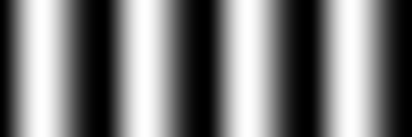

# Waveform
[Waveform](https://en.wikipedia.org/wiki/Waveform) or data types or function type or shaping functions


# old images ( d.c)
 

 

 

 

 

 


# new images (g,c)


 
 
 
 
 
 
 
 
 
 
 
 
 
 
 
 
 
 
 
 
 
 
 
 
 
 
 
 
 
 
 
 
 
 
 
 
 
 
 
 
 
 
 
 
 
 
 
 
 
 
 
 
 
 
 
 
 
 
 
 
 
 
 
 
 
 
 
 
 
 
 
 
 
 
 
 
 
 
 
 
 
 
 
 
 
 
 
 
 
 
 
 
 
 
 
 
 
 
 
 
 
 
 
 
 
 
 
 
 
 
 
 
 
 
 
 
 
 
 
 
 
 
 
 
 
 
 
 
 
 
 
 


# source code

D directort
* [d.c](./src/d/d.c)
* results of the program  are in [the text files (./src/*.txt)](./src/d)


Compile and run the program

```
gcc d.c -Wall -Wextra -lm
a.out > c.txt
gnuplot
plot "c.txt" with lines 
# save image as a c.png
```


G directory

  make

# FAQ

## How to add new shaping function (transfer function or color function or mapping function) ?
* add new functions named: Give_s
* add new enum named: s in ColorTransferFunctionType 
* use s.c program to compute code for c functions (GiveRGB_Gray and GiveColor) and for gnuplot 
* copy code 

```c
// 
double Give_s(const double position){
	
	
  double s =  position;
  return s;
}
```


# Similar repo
* [1D-RGB-color-gradient](https://github.com/adammaj1/1D-RGB-color-gradient)
* [Shaping functions in GLSL by Patricio Gonzalez Vivo & Jen Lowe](https://thebookofshaders.com/05/)
* [curves by kynd.inf ](https://www.flickr.com/photos/kynd/9546075099/in/photostream/)
* [Easing Equations by @nicmulvaney](https://web.archive.org/web/20230627221335/https://gizma.com/easing/)
* [EASING EQUATIONS by Robert Penner](https://github.com/danro/tweenman-as3/blob/master/Easing.as)
* [FlexMonkey: Interpolation-Playground-](https://github.com/FlexMonkey/Interpolation-Playground-)
* [online WebGL demo](https://www.polymonster.co.uk/pmtech/examples/maths_functions.html)


by Iñigo Quilez
* [GraphToy  = a tool to visualize GLSL functions in WebGL](https://graphtoy.com/), only function of 2 variables:  f(x,t) 
* [useful little functions ](https://iquilezles.org/articles/functions/)
* [smoothsteps/](https://iquilezles.org/articles/smoothsteps/)
* [smoothstep integral](https://iquilezles.org/articles/smoothstepintegral/)
  
  
Smoothstep
* [wikipedia](https://en.wikipedia.org/wiki/Smoothstep)
* [Smoothstep - Shader Graph Basics - Episode 15 by Ben Cloward](https://www.youtube.com/watch?v=dn3y5KVxylQ) 
* [smoothstep-looking-for-a-continuous-family-of-interpolation-functions](https://math.stackexchange.com/questions/1749250/smoothstep-looking-for-a-continuous-family-of-interpolation-functions) 
* [RSL: Using smoothstep](https://www.fundza.com/rman_shaders/smoothstep/index.html)
* [interpolations tricks](https://solhsa.com/interpolation/) or How I Learned to Stop Worrying and Love the 0..1 Range by  Jari Komppa
  
[Polynomial Shaping Functions](www.flong.com/archive/texts/code/shapers_poly): This page presents a collection of polynomial functions for shaping, tweening, and easing signals in the range [0...1]. Functions include:
* Blinn-Wyvill Approximation to the Raised Inverted Cosine
* Double-Cubic Seat
* Double-Cubic Seat with Linear Blend
* Double-Odd-Polynomial Seat
* Symmetric Double-Polynomial Sigmoids
* Quadratic Through a Given Point

[Exponential Shaping Functions](www.flong.com/archive/texts/code/shapers_exp)
* Exponential Ease-In and Ease-Out
* Double-Exponential Seat
* Double-Exponential Sigmoid
* The Logistic Sigmoid

[Circular & Elliptical Shaping Functions](www.flong.com/archive/texts/code/shapers_circ)
* Circular Interpolation: Ease-In and Ease-Out 
* Double-Circle Seat
* Double-Circle Sigmoid
* Double-Elliptic Seat
* Double-Elliptic Sigmoid
* Double-Linear with Circular Fillet
* Circular Arc Through a Given Points

[Bezier and Other Parametric Shaping Functions](www.flong.com/archive/texts/code/shapers_bez)
* Quadratic Bezier
* Cubic Bezier
* Cubic Bezier (Nearly) Through Two Given Points

# Git


```
git add README.md
git commit -m "first commit"
git branch -M main
git remote add origin git@github.com:adammaj1/Waveform.git
git push -u origin main
```

Subdirectory

```
mkdir images
git add *.png
git mv  *.png ./png
git commit -m "move"
git push -u origin main

```

then link the images:

```
 
```
to overwrite

```
git mv -f 
```

local repo : 
